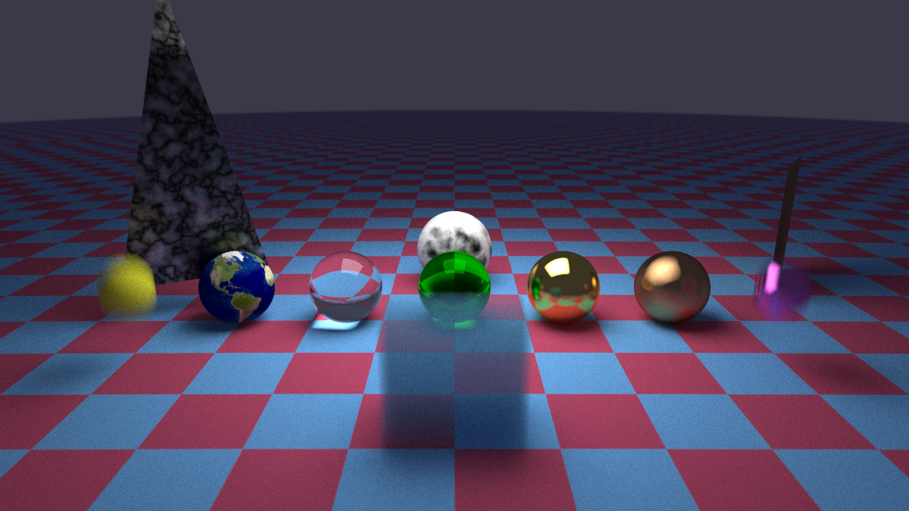

# raytracer-cpp

A CPU path tracer written in C++20. It started from Peter Shirley's *Ray Tracing in One Weekend* series and was then rewritten in modern C++ and extended beyond the books.



The showcase scene combines a textured Earth, clear glass, gold and copper metals, a marble sphere, a turbulence-noise metal triangle, a rotated metal quad, an area light, motion-blurred spheres, a volumetric medium and a thin-lens camera with depth of field.

## Features

**Core**
- Recursive path tracing with a fixed bounce limit, gamma correction and per-pixel jittered multi-sampling
- Materials: Lambertian, metal (with fuzz), dielectric (Snell's law, Schlick reflectance, total internal reflection), diffuse area light, isotropic (volume phase function)
- Geometry: spheres (static and moving), quads, triangles, boxes
- Thin-lens camera with look-at basis, vertical FOV and defocus blur
- Motion blur through per-ray shutter time

**Acceleration and textures**
- Bounding volume hierarchy (longest-axis split) with AABB slab tests
- Solid colour, 3D checker, image (via stb_image) and Perlin noise textures (smooth, turbulence, marble)
- Constant-density volumetric media (fog and smoke)

**Rendering pipeline**
- Multithreaded render loop using C++17 parallel algorithms (`std::for_each` with `std::execution::par`)
- Output to PPM and PNG (via stb_image_write)

## Beyond the books

- Rewritten in C++20: `constexpr` vector math, `std::optional` scatter results, `enum class` noise modes, parallel STL and `std::views::iota`
- A 4×4 homogeneous transform stack: `RigidMatrix` (rotation and translation) and `GeneralMatrix` (adds scale and a dedicated normal matrix), both with analytic inverses and composable with `operator*`
- Instance transforms (`RigidTransform`, `GeneralTransform`): the ray is mapped to local space, tested, and the hit point and normal are mapped back; the world-space AABB is built from the eight transformed corners
- Triangles as a specialisation of quads through a virtual interior test
- Textured metal and dielectric materials, including tinted glass
- An explicit guard in the AABB slab test for rays parallel to an axis, avoiding NaNs
- Fail-fast image loading with a clear error

What is **not** original: the basic materials, gamma correction, defocus disk, moving spheres, BVH, textures, quads, lights, boxes and constant media follow the books.

## Build and run

Requirements: Windows, Visual Studio 2022 (toolset v143), Windows SDK 10, x64.

1. Open `project.sln` in Visual Studio.
2. Select the **Release | x64** configuration. Debug works but is much slower.
3. Make sure `project/images/earthmap.jpg` exists. The Earth texture is loaded with a relative path, so the program must run from the folder that contains `images/`; Visual Studio does this by default.
4. Build and run.

The program writes `image.ppm` and `output.png` to the working directory. Resolution, samples per pixel and the scene are set in `project/main.cpp`; there is no command-line interface.

## Project structure

```
project.sln
docs/renders/            Rendered images
project/
  main.cpp               Scene, camera setup, entry point
  camera.h               Camera, render loop, output
  vec3.h ray.h           Math and rays
  matrix.h               4x4 transforms
  hittable.h             Intersection interface
  hittable_list.h bvh.h  Scene container and BVH
  sphere.h quad.h
  triangle.h             Geometry
  constant_medium.h      Volumetric media
  rigid_transform.h
  general_transform.h    Instance transforms
  material.h texture.h
  perlin.h rtw_image.h   Shading
  external/              stb_image, stb_image_write
  images/                Texture assets
```

## Known issues and limitations

- **Non-uniform scale instances.** `GeneralTransform` renormalises the transformed ray direction, so the hit-parameter window `[tmin, tmax]` is not rescaled under non-uniform scale. This may cause occlusion artefacts in rare cases. Rigid transforms are not affected.
- **Camera focus.** The viewport is placed at the distance between `lookfrom` and `lookat`, not at `focus_dist`. The two coincide in the showcase scene.
- **Sampling.** Naive Monte Carlo only: no importance sampling, next-event estimation or MIS. Small area lights are noisy and many samples per pixel are needed.
- **Triangle bounds.** Triangles reuse the bounding box of their parent parallelogram.
- **Reproducibility.** Perlin noise tables are not seeded, so noise-based materials differ between runs.
- **Platform.** Visual Studio / MSVC only; there is no CMake build.
- No scene files, mesh loader or tests.

## Planned work

- Rescale `t` correctly in `GeneralTransform`
- Place the viewport at `focus_dist`
- CMake build with a sequential fallback for `std::execution::par`
- Light sampling and importance sampling (*Ray Tracing: The Rest of Your Life*)

## Credits

- Peter Shirley, *Ray Tracing in One Weekend* series (https://raytracing.github.io)
- [stb_image and stb_image_write](https://github.com/nothings/stb) by Sean Barrett (public domain / MIT)
- Earth texture: the map used in the *Ray Tracing in One Weekend* series

## License

MIT, see [LICENSE](LICENSE).